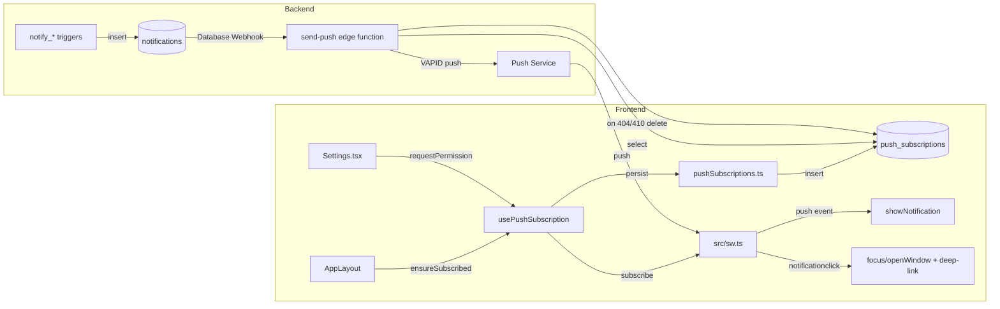

# Fluxo de Notificações — PACT

Objetivo: documentar o fluxo atual de notificações do app, desde a assinatura de eventos até a exibição e ações no painel.

## 1) Entrypoints principais
- `src/hooks/useNotifications.ts` — hook central que expõe notificações, contagem de não lidas, e funções de leitura/exclusão.
- `src/services/notifications.ts` — serviço Supabase com `fetchNotifications`, `markAsRead`, `markAllAsRead`, `deleteNotification`, `deleteAllRead`, e `subscribeToNotifications`.
- `src/components/Header.tsx` — componente que usa `useNotifications()` e abre o `NotificationPanel`.
- `src/components/NotificationPanel.tsx` — painel que mostra notificações, marca como lidas e exclui notificações.
- `src/contexts/AuthContext.tsx` — fornece `user` usado por `useNotifications()`.

## 2) Fluxo de visão geral

1. `Header.tsx` importa e chama `useNotifications()` para obter notificações do usuário atual.
2. `useNotifications()` obtém `user` de `AuthContext`.
3. O hook registra um `useEffect` que, quando `user` está presente, chama `subscribeToNotifications(user.id, onUpdate, onError)`.
4. `subscribeToNotifications()` faz uma consulta inicial com `fetchNotifications(userId)` e, em seguida, abre um canal Supabase realtime para a tabela `notifications` daquele `user_id`.
5. Quando o backend emite uma mudança em `notifications` para o usuário, o canal refaz a consulta e chama `onUpdate(data)`.
6. `useNotifications()` armazena as notificações em estado local e computa `unreadCount` e `hasRead`.
7. `Header.tsx` mostra um sino com `unreadCount` e, ao clicar, abre `NotificationPanel`.
8. `NotificationPanel.tsx` renderiza a lista de notificações e permite marcar como lida, limpar lidas e excluir.

## 3) Ações suportadas

### Marcar como lida
- A ação de clique em cada item de notificação chama `markAsRead(n.id)` se ainda não lido.
- `useNotifications()` atualiza o estado local imediatamente para evitar atraso na UI.
- O hook chama `markAsRead(notificationId)` em `services/notifications.ts`, que atualiza `read_at` no Supabase.

### Marcar todas lidas
- Botão `Marcar lidas` chama `markAllAsRead()`.
- O hook atualiza todos os itens locais para `read_at = now`.
- O serviço `markAllAsRead(userId)` atualiza todas as notificações não lidas do usuário no banco.

### Excluir notificação
- Botão de exclusão individual chama `deleteNotification(n.id)`.
- O hook remove localmente o item e chama o serviço correspondente.

### Limpar lidas
- Botão `Limpar lidas` chama `deleteAllRead()`.
- O hook remove localmente todas as notificações com `read_at` não nulo.
- O serviço `deleteAllRead(userId)` deleta todas as notificações lidas do usuário.

## 4) Detalhes do serviço Supabase

- `notifications` é a tabela usada para armazenar notificações.
- As consultas usam `user_id=eq.${userId}`.
- O realtime está configurado em `postgres_changes` para a tabela `notifications`.
- O canal é nomeado com `notifications:${userId}:${crypto.randomUUID()}` para evitar conflitos de assinaturas concorrentes.

## 5) Renderização e experiência de usuário

- No desktop, o sino e o painel ficam no `Header.tsx` dentro da sidebar.
- No mobile, o sino também aparece no cabeçalho e usa o mesmo painel.
- O painel é exibido via `createPortal(document.body)` em `NotificationPanel.tsx`.
- Notificações não lidas recebem fundo diferente e um ponto de destaque.
- Notificações são exibidas com ícone condicional com base em `type`: `new_shared_expense`, `debt_settled`, `partner_joined` ou padrão.

## 6) Pontos de atenção

- O hook não trata especificamente erros além do `console.error`.
- O serviço `subscribeToNotifications` sempre refaz a consulta completa quando qualquer mudança de `notifications` ocorre.
- Não há paginação além do limite de 50 notificações.
- O painel não navega automaticamente para nenhuma rota a partir de uma notificação; o clique apenas marca como lida.

## 7) Diagrama do fluxo

```mermaid
flowchart LR
  U[AuthContext] -->|user| H[useNotifications()]
  H -->|subscribe| S[subscribeToNotifications()]
  S -->|fetch| DB[notifications (Supabase)]
  S -->|realtime| DB
  H -->|props| Header
  Header -->|open| NP[NotificationPanel]
  NP -->|mark read| S2[markAsRead()]
  NP -->|mark all read| S3[markAllAsRead()]
  NP -->|delete| S4[deleteNotification()]
  NP -->|delete all read| S5[deleteAllRead()]
```

## 9) Push notifications (PWA)

Além do fluxo in-app acima, o Pact envia notificações push reais do sistema operacional (Android Chrome e iOS Safari 16.4+ em PWA instalada), mesmo com o app fechado.

### Componentes

- `src/sw.ts` — Service Worker customizado (estratégia `injectManifest` do `vite-plugin-pwa`, configurada em `vite.config.ts`). Mantém o precache normal do PWA e adiciona dois listeners: `push` (mostra a notificação do SO) e `notificationclick` (foca/abre a janela navegando para a URL do payload).
- `src/hooks/usePushSubscription.ts` — hook que expõe `permissionState` (`default`/`granted`/`denied`/`unsupported`), `isIosNonInstalled`, `requestPermission()` e `ensureSubscribed()`.
- `src/services/pushSubscriptions.ts` — `upsertSubscription`/`deleteSubscriptionByEndpoint` na tabela `push_subscriptions` (RLS por `user_id`).
- `src/pages/Settings.tsx` — seção "Notificações push" com os 4 estados de permissão e botão de ativar.
- `src/layouts/AppLayout.tsx` — chama `ensureSubscribed()` uma vez quando o usuário autentica, para manter a subscription viva em dispositivos que já concederam permissão antes.
- `supabase/functions/send-push/index.ts` — Edge Function que recebe o payload do Database Webhook, busca as subscriptions do `user_id`, resolve o deep-link (`resolveDeepLink.ts`) e envia o push via VAPID (`jsr:@negrel/webpush`). Remove subscriptions que respondem 404/410.
- Database Webhook nativo do Supabase: `INSERT` em `notifications` → POST para `send-push`.
- `supabase/migrations/20260629000000_create_push_subscriptions.sql` — schema da tabela.

### Fluxo de subscription (frontend)

1. Usuário autenticado entra no app → `AppLayout` chama `ensureSubscribed()`.
2. Se a permissão já foi concedida antes, garante que existe uma `PushSubscription` salva (idempotente).
3. Se ainda não foi pedida, o usuário ativa manualmente em `Settings.tsx` → `requestPermission()` → `Notification.requestPermission()` → se `granted`, assina via `registration.pushManager.subscribe()` (chave pública VAPID) e persiste em `push_subscriptions`.
4. iOS Safari fora de uma PWA instalada não suporta a Push API — a UI mostra instrução para "Adicionar à Tela de Início" em vez do prompt.

### Fluxo de envio (backend)

1. Uma das funções já existentes no Supabase (`notify_new_shared_expense`, `notify_debt_settled`, `notify_partner_joined`) insere uma linha em `notifications` (mesmo fluxo de sempre, sem mudança).
2. O Database Webhook do Supabase dispara a Edge Function `send-push` no `INSERT`.
3. `send-push` busca as subscriptions do `user_id`, resolve a URL de deep-link a partir de `notifications.type`/`notifications.data.partnership_id` e envia o push (VAPID) para cada subscription.
4. Subscriptions que retornam 404/410 são removidas automaticamente.
5. No dispositivo, `src/sw.ts` recebe o evento `push`, mostra a notificação nativa; ao clicar, foca/abre o app navegado para a rota resolvida.

### Mapa de deep-link

| `notifications.type` | Rota |
|---|---|
| `new_shared_expense` | `/shared/${data.partnership_id}` |
| `debt_settled` | `/shared/${data.partnership_id}` |
| `partner_joined` | `/shared/${data.partnership_id}` |
| desconhecido/sem `partnership_id` | `/` (fallback) |

### Diagrama



### Referência de planejamento

Spec, design e tasks completos em `.specs/features/web-push-notifications/`.

## 10) Referências
- `src/hooks/useNotifications.ts`
- `src/services/notifications.ts`
- `src/components/Header.tsx`
- `src/components/NotificationPanel.tsx`
- `src/contexts/AuthContext.tsx`
- `src/sw.ts`
- `src/hooks/usePushSubscription.ts`
- `src/services/pushSubscriptions.ts`
- `supabase/functions/send-push/index.ts`
