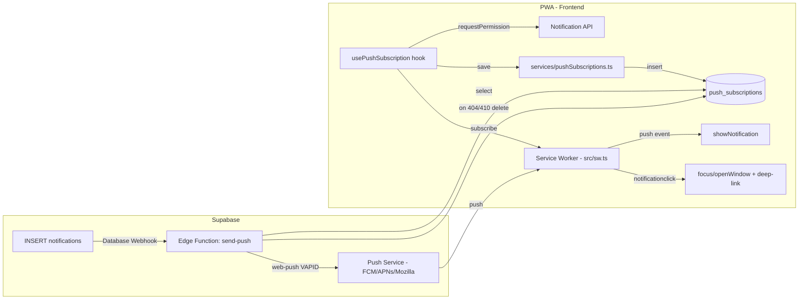

# Web Push Notifications Design

**Spec**: `.specs/features/web-push-notifications/spec.md`
**Status**: Draft

---

## Research Notes (Knowledge Verification Chain)

- **vite-plugin-pwa**: o projeto usa hoje a estratégia padrão `generateSW` (workbox autogerado, sem hooks customizados). Para registrar listeners `push` e `notificationclick`, é necessário trocar para `strategies: 'injectManifest'` com um arquivo de Service Worker próprio (`src/sw.ts`), que importa `precacheAndRoute` do `workbox-precaching` e chama `precacheAndRoute(self.__WB_MANIFEST)` para manter o cache atual, adicionando os listeners customizados ao lado. [vite-pwa-org.netlify.app/guide/inject-manifest]
- **Supabase Database Webhooks**: o Supabase tem um recurso nativo (Dashboard → Database → Webhooks) que dispara uma Edge Function via HTTP POST quando ocorre INSERT/UPDATE/DELETE numa tabela — exatamente o gatilho que precisamos no INSERT de `notifications`, sem precisar escrever um trigger SQL customizado com `pg_net`. [supabase.com/docs/guides/database/webhooks]
- **Envio do push (VAPID) a partir de uma Edge Function (Deno)**: confirmei que Supabase tem um guia oficial de push notifications a partir de Edge Functions, mas os exemplos oficiais encontrados são focados em Expo/FCM, não em Web Push padrão (VAPID) puro. ⚠️ **Não tenho confirmação direta de um exemplo oficial Supabase usando a lib `web-push` em Deno** — isso precisa ser validado na fase Execute (a lib `web-push` (npm) costuma funcionar via `npm:web-push` no Deno do Supabase Edge Runtime, mas o comportamento exato de geração de JWT VAPID deve ser testado, não assumido).

---

## Architecture Overview

Dois fluxos novos, plugados no sistema existente sem alterar o fluxo in-app atual:

1. **Fluxo de subscription (frontend)**: usuário concede permissão → SW registra `PushSubscription` no navegador → app salva endpoint+keys em `push_subscriptions` (Supabase, RLS por `user_id`).
2. **Fluxo de envio (backend)**: insert em `notifications` → Database Webhook do Supabase chama Edge Function `send-push` → função busca subscriptions do `user_id`, envia push via VAPID/web-push para cada uma, remove subscriptions que retornarem 404/410.



---

## Code Reuse Analysis

### Existing Components to Leverage

| Component | Location | How to Use |
|---|---|---|
| `Notification` type + tabela `notifications` | `src/services/notifications.ts` | Continua sendo a fonte da verdade; nenhuma mudança no schema/lógica existente |
| `useNotifications` hook | `src/hooks/useNotifications.ts` | Não muda; push é um canal adicional, não substitui o realtime in-app |
| `AuthContext` (`user.id`) | `src/contexts/AuthContext.tsx` | Mesmo padrão de obter `user.id` para vincular subscriptions |
| `supabase` client | `src/services/supabase.ts` | Reusado para inserir/ler `push_subscriptions` |
| `Settings.tsx` (página existente) | `src/pages/Settings.tsx` | Local natural para o toggle manual "Ativar notificações push" e estado de permissão |
| `VitePWA` config | `vite.config.ts` | Atualizado (não recriado) para trocar `generateSW` → `injectManifest` |

### Integration Points

| System | Integration Method |
|---|---|
| Supabase Database | Nova tabela `push_subscriptions` com RLS (`user_id = auth.uid()`); nenhuma mudança nas tabelas existentes |
| Supabase Database Webhooks | Novo webhook (configurado via Dashboard/MCP) escutando INSERT em `notifications`, chamando a Edge Function `send-push` |
| Supabase Edge Functions | Nova função `send-push` (Deno), usa Service Role Key para ler subscriptions e VAPID private key (secret) para assinar o push |
| Browser Push API | Novo Service Worker customizado (`src/sw.ts`) com listeners `push` e `notificationclick` |

---

## Components

### `src/sw.ts` (novo, substitui o SW autogerado)

- **Purpose**: Service Worker customizado que mantém o precache do PWA atual e adiciona suporte a push.
- **Location**: `src/sw.ts`
- **Interfaces**:
  - `self.addEventListener('push', (event) => ...)` — parseia `event.data.json()`, chama `self.registration.showNotification(title, { body, icon, data })`.
  - `self.addEventListener('notificationclick', (event) => ...)` — fecha a notificação, usa `clients.matchAll`/`openWindow` para focar ou abrir o app na rota de `event.notification.data.url`.
- **Dependencies**: `workbox-precaching` (`precacheAndRoute(self.__WB_MANIFEST)`), config `injectManifest` no `vite.config.ts`.
- **Reuses**: nada de novo no frontend além do que o `vite-plugin-pwa` já gera; só muda a estratégia de build do SW.

### `src/hooks/usePushSubscription.ts` (novo)

- **Purpose**: Hook que encapsula todo o ciclo de permissão + subscription, espelhando o padrão de `useNotifications.ts`.
- **Location**: `src/hooks/usePushSubscription.ts`
- **Interfaces**:
  - `permissionState: 'default' | 'granted' | 'denied' | 'unsupported'`
  - `isIosNonInstalled: boolean` — detecta iOS Safari fora de PWA instalada (via `navigator.standalone`/`matchMedia('(display-mode: standalone)')` + UA check)
  - `requestPermission(): Promise<void>` — chama o fluxo completo (permission → subscribe → persist)
  - `ensureSubscribed(): Promise<void>` — idempotente, chamado em todo login se `permissionState === 'granted'`
- **Dependencies**: `AuthContext` (`user.id`), `services/pushSubscriptions.ts`, Service Worker registrado pelo `vite-plugin-pwa` (`virtual:pwa-register`)
- **Reuses**: mesmo padrão de hook + service usado por `useNotifications`/`services/notifications.ts`

### `src/services/pushSubscriptions.ts` (novo)

- **Purpose**: CRUD de subscriptions no Supabase, espelhando `services/notifications.ts`.
- **Location**: `src/services/pushSubscriptions.ts`
- **Interfaces**:
  - `upsertSubscription(userId: string, sub: PushSubscriptionJSON): Promise<void>`
  - `deleteSubscriptionByEndpoint(endpoint: string): Promise<void>` (usado no unsubscribe manual)
- **Dependencies**: `services/supabase.ts`
- **Reuses**: mesmo client `supabase` já configurado

### `Settings.tsx` (modificado)

- **Purpose**: Adicionar seção "Notificações push" com estado atual (ativado/negado/não suportado/iOS sem instalar) e botão de ativar.
- **Location**: `src/pages/Settings.tsx`
- **Reuses**: `usePushSubscription` hook; segue o mesmo design system (`.card`, `--primary`, etc.)

### Edge Function `send-push` (novo, Supabase)

- **Purpose**: Recebe o payload do Database Webhook (linha inserida em `notifications`), busca subscriptions do `user_id` e envia o push via VAPID.
- **Location**: gerenciada no Supabase (aplicada via MCP `deploy_edge_function`); código também versionado em `supabase/functions/send-push/index.ts` para referência/histórico no repo.
- **Interfaces**: HTTP POST recebido do Database Webhook, payload `{ type: 'INSERT', table: 'notifications', record: Notification }`.
- **Dependencies**: secrets `VAPID_PUBLIC_KEY`, `VAPID_PRIVATE_KEY`, `VAPID_SUBJECT` (mailto:), `SUPABASE_SERVICE_ROLE_KEY` (já disponível por padrão em Edge Functions); lib `jsr:@negrel/webpush` (Deno-nativa, ver Open Questions resolvidas).
- **Reuses**: tabela `notifications` (somente leitura do payload do webhook, sem nova query); tabela `push_subscriptions`.

### Tabela `push_subscriptions` (nova)

- **Purpose**: Persistir subscriptions de push por usuário/dispositivo.
- **Location**: aplicada via Supabase MCP (`apply_migration`); SQL também salvo em `supabase/migrations/` no repo para histórico.

---

## Data Models

### `push_subscriptions`

```sql
create table public.push_subscriptions (
  id uuid primary key default gen_random_uuid(),
  user_id uuid not null references auth.users(id) on delete cascade,
  endpoint text not null,
  p256dh text not null,
  auth text not null,
  user_agent text,
  created_at timestamptz not null default now(),
  last_seen_at timestamptz not null default now(),
  unique (endpoint)
);

alter table public.push_subscriptions enable row level security;

create policy "Users manage their own push subscriptions"
  on public.push_subscriptions
  for all
  using (auth.uid() = user_id)
  with check (auth.uid() = user_id);
```

```typescript
interface PushSubscriptionRow {
  id: string
  user_id: string
  endpoint: string
  p256dh: string
  auth: string
  user_agent: string | null
  created_at: string
  last_seen_at: string
}
```

**Relationships**: `user_id` → `auth.users.id` (cascade delete). N subscriptions por usuário (multi-dispositivo). `endpoint` é único (reinstalar gera um novo endpoint do navegador; o antigo, se nunca mais usado, só é limpo via 404/410 no próximo envio — aceitável, não é um problema de correção).

### Payload do push (contrato entre Edge Function e Service Worker)

```typescript
// O que a Edge Function envia via web-push (criptografado)
interface PushPayload {
  title: string        // = notifications.title
  body: string | null  // = notifications.body
  data: {
    type: string        // = notifications.type (new_shared_expense | debt_settled | partner_joined)
    url: string          // rota de deep-link já resolvida no backend, ex: "/shared/abc123"
    notificationId: string
  }
}
```

A resolução de `data.url` a partir de `notifications.type` + `notifications.data` (campo já existente) acontece **na Edge Function**, não no Service Worker — assim o SW fica simples (só usa `event.notification.data.url`) e a lógica de deep-link fica centralizada num único lugar.

| `notifications.type` | Deep-link gerado |
|---|---|
| `new_shared_expense` | `/shared/${data.partnership_id}` |
| `debt_settled` | `/shared/${data.partnership_id}` |
| `partner_joined` | `/shared/${data.partnership_id}` |
| desconhecido/sem `partnership_id` | `/` (fallback, conforme Edge Case da spec) |

✅ Confirmado na Execute (T2): formato real de `notifications.data` lido diretamente do código das funções `notify_*` já existentes no Supabase — ver seção "Open Questions / Riscos para a Execute" no final deste documento.

---

## Error Handling Strategy

| Error Scenario | Handling | User Impact |
|---|---|---|
| Navegador não suporta Push API/Service Worker | `usePushSubscription` retorna `permissionState: 'unsupported'`, nunca chama `requestPermission` | Nenhum prompt aparece; fluxo in-app intacto |
| iOS Safari fora de PWA instalada | Detecção via `standalone`/UA → `isIosNonInstalled: true` | Mensagem "Adicione à Tela de Início" em vez do botão de ativar |
| Usuário nega permissão nativa | `Notification.permission === 'denied'` persistido localmente | `Settings.tsx` mostra estado "negado" + instrução para reativar nas configs do navegador (JS não pode reabrir o prompt) |
| `subscribe()` falha (ex: VAPID key ausente/erro de rede) | `try/catch` no hook, log + não bloqueia o resto do app | Nenhuma notificação push, mas app funciona normalmente |
| Edge Function recebe `user_id` sem subscriptions | Função retorna 200 sem enviar nada | Nenhum impacto (não é erro) |
| `web-push` retorna 404/410 para um endpoint | Edge Function deleta a linha em `push_subscriptions` | Usuário simplesmente para de receber push naquele dispositivo morto; outros dispositivos não são afetados |
| `web-push` retorna outro erro (ex: 500 do push service) | Log no Edge Function, **não** deleta a subscription (pode ser falha transitória) | Próxima notificação tenta de novo |
| Deep-link sem dado suficiente | Edge Function usa fallback `/` | Clique abre a home em vez de quebrar |

---

## Tech Decisions (only non-obvious ones)

| Decision | Choice | Rationale |
|---|---|---|
| Estratégia do Service Worker | Trocar `generateSW` → `injectManifest` com `src/sw.ts` próprio | `generateSW` (workbox autogerado) não permite adicionar listeners customizados de `push`/`notificationclick`; é a única forma documentada no `vite-plugin-pwa` |
| Gatilho do envio de push | Supabase Database Webhook (nativo) no INSERT de `notifications`, chamando Edge Function | Evita escrever um trigger SQL customizado com `pg_net`; é o mecanismo recomendado pela própria Supabase para esse caso, e dispensa duplicar lógica de criação de notificação no client (que hoje nem existe no repo — é 100% server-side) |
| Resolução de deep-link | Feita na Edge Function (backend), não no Service Worker | Centraliza a lógica de mapeamento tipo→rota num único lugar, já que o SW não tem acesso a regras de negócio nem deve crescer em complexidade |
| Onde aplicar schema/Edge Function | Via Supabase MCP durante Execute, com cópia dos arquivos versionada no repo (`supabase/migrations/`, `supabase/functions/`) | Decisão do usuário: não há `supabase/` local hoje; aplicar via MCP evita passo manual, mas versionar os arquivos mantém histórico e permite reaplicar se o projeto remoto mudar |
| Permissão de notificação | Prompt customizado antes da API nativa, não automático no load | `Notification.requestPermission()` negado uma vez não pode ser re-perguntado por JS — pedir sem contexto é irreversível e gera taxa alta de rejeição |
| Identificação de iOS fora de PWA | Feature-detect (`display-mode: standalone` + `'standalone' in navigator`) em vez de UA sniffing puro | UA sniffing é frágil; combinar com `display-mode` é o padrão usado para detectar PWA instalada no iOS |

---

## Open Questions / Riscos para a Execute — Resolvidas (T2)

1. **Lib de VAPID/web-push em Deno**: confirmado via pesquisa que o guia oficial do Supabase ("Sending Push Notifications") cobre apenas Expo/FCM, sem exemplo de VAPID/Web Push puro. Não há confirmação de que `npm:web-push` funcione sem atrito no Edge Runtime. **Decisão**: usar `jsr:@negrel/webpush`, uma lib Deno-nativa construída só com Web APIs, especificamente para este caso (Web Push + VAPID em Deno) — menor risco que depender de polyfills Node. Uso: `webpush.ApplicationServer.new({ contactInformation: 'mailto:...', vapidKeys })`, depois `appServer.subscribe(subscription).pushTextMessage(msg, {})`.
2. **Formato real de `notifications.data`**: confirmado lendo o código-fonte das funções já existentes no Supabase (`notify_new_shared_expense`, `notify_debt_settled`, `notify_partner_joined`, todas `SECURITY DEFINER` em `public`):
   - `new_shared_expense` → `{ partnership_id, expense_id }`
   - `debt_settled` → `{ partnership_id, settlement_id }`
   - `partner_joined` → `{ partnership_id }`

   Não existe `groupId` — é `partnership_id` em todos os casos, que mapeia 1:1 para o param `:groupId` da rota `/shared/:groupId` (`src/App.tsx`). A tabela de deep-link do design original fica:

   | `notifications.type` | Deep-link gerado |
   |---|---|
   | `new_shared_expense` | `/shared/${data.partnership_id}` |
   | `debt_settled` | `/shared/${data.partnership_id}` |
   | `partner_joined` | `/shared/${data.partnership_id}` |
   | desconhecido/sem `partnership_id` | `/` (fallback) |

3. iOS push só funciona em iOS 16.4+; não há como detectar a versão exata via feature-detect confiável — o fallback será "se não suporta a API, mostra a instrução de instalar/atualizar", sem mensagem específica de versão.
